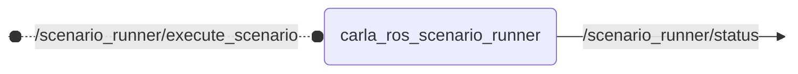

# `carla_ros_scenario_runner`

Runs OpenSCENARIO scenarios in CARLA via ROS.

This [docker-ros](https://github.com/ika-rwth-aachen/docker-ros) pipeline packages the [OpenADS CARLA Scenario Runner](github.com/openads-project/carla-scenario-runner) together with the [ROS 2 scenario runner node](https://github.com/openads-project/carla-ros-bridge/tree/carla_ros_scenario_runner). The resulting images provide a reproducible setup for running OpenSCENARIO files with CARLA

## Nodes

### `carla_ros_scenario_runner`

The `carla_ros_scenario_runner` node exposes a ROS service for executing OpenSCENARIO scenarios in CARLA. When a new scenario is requested while another scenario is still running, the running scenario is stopped before the new one is executed. The current scenario runner state is published continuously so downstream tools, including RViz integrations, can observe the execution status.

#### Published Topics

| Topic | Type | Description |
| --- | --- | --- |
| `/scenario_runner/status` | `carla_ros_scenario_runner_types/msg/CarlaScenarioRunnerStatus` | current scenario runner execution status |

#### Services

| Service | Type | Description |
| --- | --- | --- |
| `/scenario_runner/execute_scenario` | `carla_ros_scenario_runner_types/srv/ExecuteScenario` | execute an OpenSCENARIO scenario; stops any currently running scenario first |

## Launch Files

### [`carla_ros_scenario_runner.launch.py`](https://github.com/openads-project/carla-ros-bridge/tree/carla_ros_scenario_runner/launch/carla_ros_scenario_runner.launch.py)

| Argument | Default | Description |
| --- | --- | --- |
| `host` | `"localhost"` | CARLA host |
| `port` | `"2000"` | CARLA port |
| `role_name` | `"ego_vehicle"` | ego vehicle role name |
| `scenario_runner_path` | required | path to the Scenario Runner installation used by the node |
| `wait_for_ego` | `"True"` | wait for the ego vehicle before running a scenario |

## Official Documentation

- [Scenario Runner](https://github.com/carla-simulator/scenario_runner)
- [CARLA ROS Scenario Runner](https://github.com/carla-simulator/ros-bridge/tree/master/carla_ros_scenario_runner)
